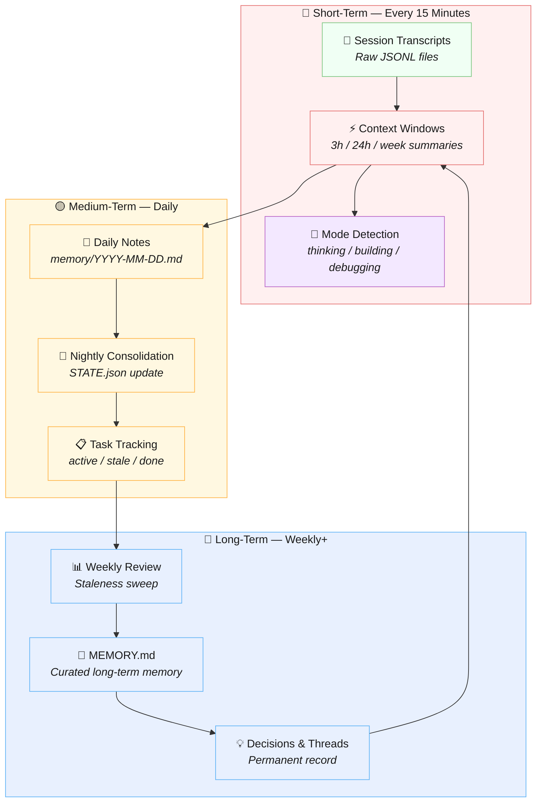
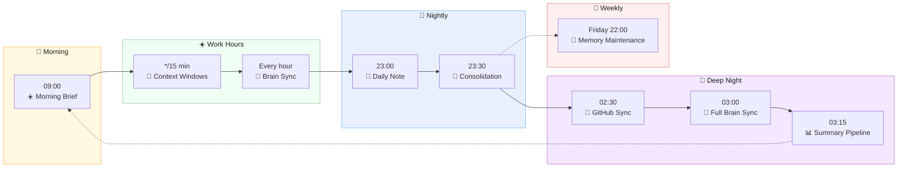
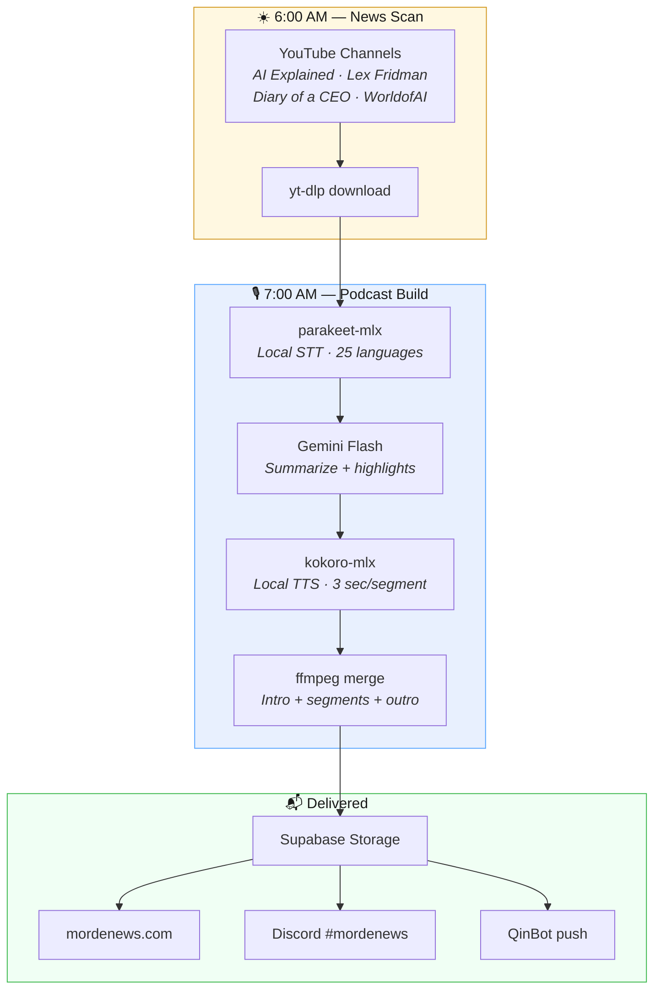
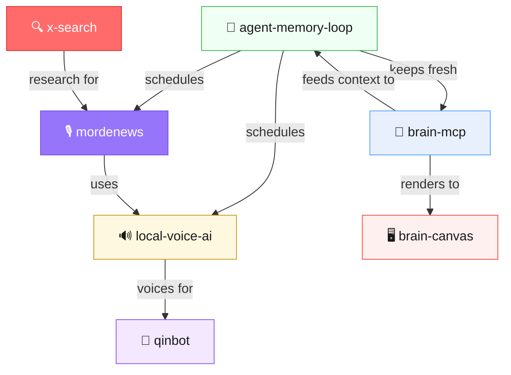

# 🔄 agent-memory-loop

**Your AI agent has amnesia. This fixes it.**

Every AI agent wakes up with zero memory. Your carefully crafted context? Gone after a restart. The decision you made yesterday? Forgotten. The task you started last week? What task?

`agent-memory-loop` is the maintenance layer that makes stateless LLMs feel stateful. A set of cron jobs and scripts that automatically build **short-term → medium-term → long-term memory** — so your agent always knows where it left off.

> *Born from 12 months of running a personal AI agent 24/7. Not theoretical — extracted from a system that manages 380K+ messages across 42 sessions per day.*

---

## 📊 Live System Status

<!-- STATUS:START -->
> Last checked: —

| Status | Job | Schedule | Purpose | Last Run | Next Run |
|--------|-----|----------|---------|----------|----------|
| ❓ | **context-windows** | `*/15 * * * *` | 3h/24h/week context summaries | — | — |
| ❓ | **brain-sync-hourly** | `5 * * * *` | Sessions → parquet | — | — |
| ❓ | **daily-notes** | `0 23 * * 0-4,6` | Write memory/YYYY-MM-DD.md | — | — |
| ❓ | **nightly-consolidation** | `30 23 * * 0-4,6` | Update STATE.json | — | — |
| ❓ | **weekly-memory-maintenance** | `0 22 * * 5` | Review week → update MEMORY.md | — | — |
| ❓ | **brain-sync-unified** | `0 3 * * *` | All sources + embeddings | — | — |
| ❓ | **brain-summary-pipeline** | `15 3 * * *` | New convos → structured summaries | — | — |
| ❓ | **github-sync** | `30 2 * * *` | GitHub repos + commits | — | — |
<!-- STATUS:END -->

*This table updates automatically via cron. See [update-readme.sh](update-readme.sh).*

---

## 🧠 The Memory Cascade

Most "memory" solutions are just a vector database with a retrieval step. That's like giving a human a library card and calling it a brain.

Real memory is **layered**. Short-term fades fast. Medium-term gets consolidated overnight. Long-term is curated over weeks. `agent-memory-loop` replicates this:



---

## ⏰ The 24-Hour Loop

Here's what a day looks like when your agent has memory:



---

## 🔀 Stateless → Stateful

**Without agent-memory-loop:**
```
Session 1: "Deploy the API to Railway"
Session 2: "What API? I don't know what you're talking about."
Session 3: "We discussed this yesterday..." / "I have no memory of that."
```

**With agent-memory-loop:**
```
Session 1: "Deploy the API to Railway"
           → 📝 Captured in daily note, task added to STATE.json

Session 2: "What's the status?"
           → 💭 Context: Railway deploy active, started yesterday, 
                         3 sessions of work logged, mode: building

Session 3: "Let's finish the deploy"
           → 🧠 Full context loaded: task t015 active (high priority),
                 last touched 2h ago, decision d008 chose Railway over Vercel,
                 thread th004 "API Infrastructure" active since Tuesday
```

---

## 👁️ See It In Action

These are **real outputs** from a production system managing 380K+ messages across 42 sessions/day.

### Context Windows — What Your Agent Sees Every 15 Minutes

```
$ memory-loop run context-windows

📡 Scanning sessions...

# Context Windows — Auto-Generated
Last updated: 2026-03-01 22:30 IST

## 🔴 LAST 3 HOURS
Sessions: 8 | Messages: 353 | Mode: 💭 thinking

### Topics
- clawdbot (38x)
- queued (36x)
- users (34x)
- findings (28x)
- agent (24x)

## 🟡 LAST 24 HOURS
Sessions: 43 | Messages: 476 | Mode: 💭 thinking

## 🔵 LAST WEEK
Sessions: 337 | Messages: 1991 | Mode: 🎭 conducting

✅ Written to memory/context-windows-current.md
```

### Staleness Sweep — What Your Agent Catches Weekly

```
$ memory-loop sweep

🧹 STATE.json Sweep — 2026-03-01 22:30 IST
==================================================

📊 Summary:
  active: 12
  done: 7
  stale: 8
  waiting: 1
  archived: 3
  TOTAL: 31

⚠️ Newly stale items (3):
  🔴 t025: Closing the Circle thesis site — deploy and polish
  🔴 t004: Film pilot videos — start with #31, #25, #09
  🔴 t022: Positioning plan execution — Week 1 actions

🔥 Active high-priority:
  → t033: Brain MCP open-source launch — research + packaging
  → t005: EpicAgents/Persofi — client work + hour tracking

💤 Dormant threads:
  → th001: Cognitive Sovereignty / SMAT Thesis Site (9 days)
  → th004: Content pipeline — videos + Substack + arXiv (19 days)
```

> Every stale item, dormant thread, and priority conflict is surfaced automatically. Your agent never "forgets" an open task — it just tells you what slipped.

---

## 🌍 Real World: MordeNews Daily Podcast

`agent-memory-loop` powers a fully automated daily podcast that scans YouTube, transcribes, summarizes, and generates audio — all running as cron jobs on a single Mac.



**Real run from production:**

```
📰 MordeNews Daily — 2026-03-01

Sources: AI Explained, WorldofAI, Diary of a CEO, Lex Fridman
Segments: 70 | Duration: 13:33 | Size: 7.5 MB

Pipeline: yt-dlp → parakeet-mlx → Gemini Flash → kokoro-mlx → ffmpeg
Total time: ~10 minutes (fully local except Gemini summarization)
```

One of the podcast segments captured this moment — WorldofAI covering the agent framework this system runs on:

> *"Recently, we have all seen the internet go crazy over the autonomous AI agent that lives within your computer called Clodbot, which has now already been rebranded to Open Clod... Like here, for example, where Clodbot literally builds an entire app just by typing a prompt through WhatsApp."*

The entire pipeline — scan, transcribe, summarize, speak, deliver — runs unattended as cron jobs. No human intervention. That's `agent-memory-loop` in action.

### Today's actual news feed (March 1, 2026 — from Supabase):

| | Story | Source | Why it matters |
|---|---|---|---|
| 🔴 | **Anthropic Refuses Pentagon $200M Contract** — CEO Dario Amodei publicly refused to loosen Claude safety restrictions for military use. First major AI lab to reject a direct government ultimatum. | AI Blueprint | AI safety vs. capability tension — the defining question of 2026 |
| 💼 | **Jack Dorsey Replaces ~4K Block Employees with AI** — Block's internal AI agent saves 8-10 hrs/week per worker. Stock soared 20%+. | The Rundown | The AI tsunami hitting white-collar jobs — at scale, in public |
| 🎭 | **Perplexity Computer: 19-Model Orchestration for $200/mo** — Deploys specialized sub-agents with independent sandboxed environments. Claude 4.6 + GPT-5.2 + Gemini orchestrated together. | AI Breakfast | Validates the "orchestra conductor" architecture — multiple AI models, one system |
| 🎨 | **Google Nano Banana 2: #1 Image Gen at Half the Cost** — Reclaims leaderboard top. 512px to 4K, $0.067 per 1K images. | The Rundown AI | Cost collapse in image generation — high-volume workflows now economically viable |
| 🌐 | **World Labs Raises $1B for Spatial AI** — Fei-Fei Li's startup backed by Nvidia, AMD, Autodesk. 3D world models for robotics. | AI Blueprint | The next frontier after language: spatial reasoning |

*All auto-collected at 6:00 AM, summarized by Gemini, delivered as audio podcast by 7:08 AM. Zero human involvement.*

🎧 **Listen to today's episode:** [MordeNews Daily — March 1, 2026 (MP3)](https://xsjyfneizfkbitmzbrta.supabase.co/storage/v1/object/public/podcast-audio/daily_2026-03-01.mp3)

---

## 🚀 Quick Start

### Install

```bash
pip install agent-memory-loop
```

### Initialize

```bash
# Create your memory directory
mkdir -p memory

# Copy the example config
cp examples/brain.yaml brain.yaml

# Create initial STATE.json
cp examples/state.example.json STATE.json

# Edit brain.yaml to point to YOUR session files
```

### Run

```bash
# Check system status
memory-loop status

# Generate context windows (run every 15 min via cron)
memory-loop run context-windows

# Generate today's daily note (run at 23:00)
memory-loop run daily-notes

# Run nightly consolidation (run at 23:30)
memory-loop run consolidation

# Find stale items (run weekly)
memory-loop sweep

# Update README status table (run hourly)
memory-loop update-readme
```

### Set Up Cron

```bash
# Add to crontab (crontab -e):
*/15 * * * *    cd /path/to/project && memory-loop run context-windows
0 23 * * 0-4,6  cd /path/to/project && memory-loop run daily-notes
30 23 * * 0-4,6 cd /path/to/project && memory-loop run consolidation
0 22 * * 5      cd /path/to/project && memory-loop sweep
0 * * * *       cd /path/to/project && ./update-readme.sh
```

Or use your agent framework's cron system (e.g., Clawdbot, LangGraph, CrewAI).

---

## 📋 STATE.json — The Task Backbone

STATE.json is the **source of truth** for what's open, done, stale, and decided. It solves the "stale TODO" problem where the agent writes "X is pending" and never updates it.

### Schema

```json
{
  "version": 1,
  "lastAudit": "2026-03-01T22:00:00+00:00",
  "tasks": [{
    "id": "t001",
    "title": "Ship the landing page",
    "status": "active",
    "priority": "high",
    "created": "2026-02-28T10:00:00+00:00",
    "lastTouched": "2026-03-01T18:00:00+00:00",
    "staleAfterDays": 5,
    "context": "Scaffolded, needs deploy.",
    "source": "memory/2026-02-28.md",
    "signals": ["src/app/page.tsx"]
  }],
  "decisions": [{
    "id": "d001",
    "description": "Use cron + flat files over a database",
    "date": "2026-02-28T14:00:00+00:00",
    "context": "Simplicity wins for single-agent.",
    "supersedes": null
  }],
  "threads": [{
    "id": "th001",
    "topic": "Agent memory architecture",
    "status": "active",
    "lastActivity": "2026-03-01T18:00:00+00:00",
    "notes": "Building the cascade."
  }]
}
```

### Status Values

| Status | Meaning | Emoji |
|--------|---------|-------|
| `active` | Being worked on | 🟢 |
| `waiting` | Blocked on external input | ⏳ |
| `blocked` | Can't proceed (technical) | 🔴 |
| `done` | Completed | ✅ |
| `stale` | Not touched past threshold | ⚠️ |
| `archived` | Abandoned / irrelevant | 📦 |

### Rules

1. **Never just append** — update existing entries' `status` and `lastTouched`
2. **Never delete** — change status to `done`, `archived`, or `stale`
3. **Keep context brief** — 1-2 sentences max
4. **Be honest** — if something wasn't touched, don't pretend

---

## 🗓️ Full Cron Schedule

The complete maintenance loop, as run in production:

| Schedule | Job | Purpose |
|----------|-----|---------|
| `*/15 * * * *` | `context-windows` | 3h/24h/week context summaries |
| `5 * * * *` | `brain-sync-hourly` | Sessions → parquet |
| `0 23 * * 0-4,6` | `daily-notes` | Write `memory/YYYY-MM-DD.md` |
| `30 23 * * 0-4,6` | `nightly-consolidation` | Update STATE.json |
| `0 22 * * 5` | `weekly-memory-maintenance` | Review week → update MEMORY.md |
| `0 3 * * *` | `brain-sync-unified` | All sources + embeddings |
| `15 3 * * *` | `brain-summary-pipeline` | New convos → structured summaries |
| `30 2 * * *` | `github-sync` | GitHub repos + commits |
| `0 6 * * *` | `mordenews-scan` | News scan |
| `0 7 * * *` | `mordenews-podcast` | News → TTS podcast |
| `0 9 * * 0-4,6` | `morning-brief` | Daily briefing |
| `0 10 * * *` | `gog-auth-check` | Gmail OAuth watchdog |

> **Note on Shabbat:** Schedule `0-4,6` = Sun–Thu + Sat. Friday (5) is reserved for weekly maintenance only. Respect your rhythms.

---

## 📁 Directory Structure

```
your-project/
├── memory/
│   ├── context-windows-current.md  ← Auto-generated every 15 min
│   ├── 2026-03-01.md               ← Daily note
│   ├── 2026-02-28.md               ← Yesterday
│   └── ...
├── STATE.json                       ← Task/decision/thread tracking
├── MEMORY.md                        ← Curated long-term memory
├── brain.yaml                       ← Configuration
└── update-readme.sh                 ← Cron script for live README
```

---

## 🔧 How It Works

### Context Windows (`*/15 * * * *`)

Scans your agent's session transcripts (JSONL files) and generates a structured summary:

- **Topics** — most frequent meaningful words
- **Mode** — thinking / building / debugging / exploring / conducting
- **Decisions** — messages containing decision language ("let's go with...", "decided to...")
- **Session count** — how many conversations in the window

Three overlapping windows give you immediate (3h), today (24h), and this-week context.

### Daily Notes (`0 23 * * *`)

At end of day, generates `memory/YYYY-MM-DD.md` with:
- Topics discussed
- Decisions made  
- Tasks started/completed
- Observations (session count, message volume, focus patterns)

Won't overwrite human-edited notes — appends an auto-generated section if the file already exists.

### Nightly Consolidation (`30 23 * * *`)

The medium-term memory consolidation:
1. Reads today's daily note
2. Reads current STATE.json
3. Marks stale items (past their `staleAfterDays` threshold)
4. Generates a prompt for an LLM agent to intelligently update tasks
5. Updates the audit timestamp

### Staleness Sweep (`weekly`)

Finds items that haven't been touched within their threshold. Reports:
- Newly stale items
- Active high-priority items
- Waiting items
- Dormant threads

---

## 🤖 Agent Integration

### With Your Agent's Startup

```python
from agent_memory_loop.context_windows import ContextWindowsConfig, generate_all
from agent_memory_loop.state import StateManager

# On session start: load context
state = StateManager("STATE.json")
state.load()
summary = state.summary()

# Read the latest context window
context = open("memory/context-windows-current.md").read()

# Inject into your agent's system prompt
system_prompt = f"""
Current context:
{context}

Active tasks: {summary['active_high_priority']}
Stale items: {summary['newly_stale']}
"""
```

### With the CLI

```bash
# In your agent's startup script:
CONTEXT=$(memory-loop status --json-output)
echo "$CONTEXT"  # Pipe into your agent
```

---

## 🧪 Development

```bash
# Clone
git clone https://github.com/mordechaipotash/agent-memory-loop.git
cd agent-memory-loop

# Install in dev mode
pip install -e ".[dev]"

# Run tests
pytest

# Lint
ruff check .
```

---

## 🐚 Shell Scripts (Standalone)

The `examples/` directory includes the **original bash scripts** that this Python package was built from. They've been running in production for months and work without any pip dependencies.

| File | What It Does | Python Equivalent |
|------|-------------|-------------------|
| [`generate-context-window.sh`](examples/generate-context-window.sh) | Scans JSONL sessions, extracts topics/mode/decisions, writes `context-windows-current.md` | `memory-loop run context-windows` |
| [`state-sweep.sh`](examples/state-sweep.sh) | Finds stale items in STATE.json past their threshold | `memory-loop sweep` |
| [`consolidation-prompt.md`](examples/consolidation-prompt.md) | LLM prompt template for nightly STATE.json consolidation | `memory-loop run consolidation` |

### When to use the shell scripts

- **Quick setup** — copy one script + add a cron job, done in 30 seconds
- **Understanding the code** — read 80 lines of bash instead of navigating a Python package
- **Minimal environments** — servers where you don't want pip, venvs, or Python dependencies
- **Customization** — fork a single file, no package structure to worry about

### Configuration

All scripts use environment variables with sensible defaults:

```bash
export AGENT_WORKSPACE="$HOME/my-project"        # Default: $HOME/agent-workspace
export AGENT_SESSIONS_DIR="$HOME/.my-agent/sessions"  # Default: $HOME/.clawdbot/agents/main/sessions
export STATE_JSON_PATH="$AGENT_WORKSPACE/STATE.json"   # Default: $AGENT_WORKSPACE/STATE.json
```

### Cron setup (shell scripts only)

```bash
# crontab -e
*/15 * * * *  /path/to/examples/generate-context-window.sh 3h
*/15 * * * *  /path/to/examples/generate-context-window.sh 24h
*/15 * * * *  /path/to/examples/generate-context-window.sh week
0 10 * * 0    /path/to/examples/state-sweep.sh
```

For nightly consolidation, feed `consolidation-prompt.md` to your LLM agent (via Clawdbot cron, Claude CLI, or any agent framework).

---

## 📖 Philosophy

This project exists because I run a personal AI agent 24/7 and got tired of it waking up with amnesia every session.

The insight: **memory isn't a feature, it's infrastructure.** You don't "add memory" to an agent — you build a maintenance layer that runs alongside it, continuously, the way sleep consolidates human memory.

The tools here are extracted from 12 months of production use. They're simple (bash scripts, JSON files, cron jobs) because simple things run forever. No databases, no vector stores, no complex dependencies — just files and time.

> *"Every AI agent wakes up with amnesia. This fixes it."*

---

## 🔗 Part of the AI Agent Ecosystem

agent-memory-loop is the maintenance layer in a modular AI agent stack — keeping memory fresh, scheduling tasks, and ensuring nothing falls through the cracks.



| Repo | What | Stars |
|------|------|-------|
| [brain-mcp](https://github.com/mordechaipotash/brain-mcp) | Memory — 25 MCP tools, cognitive prosthetic | ⭐ 17 |
| [brain-canvas](https://github.com/mordechaipotash/brain-canvas) | Visual display for any LLM | ⭐ 11 |
| [local-voice-ai](https://github.com/mordechaipotash/local-voice-ai) | Voice — Kokoro TTS + Parakeet STT, zero cloud | ⭐ 1 |
| **[agent-memory-loop](https://github.com/mordechaipotash/agent-memory-loop)** | **This repo** — cron, context windows, STATE.json | ⭐ 1 |
| [x-search](https://github.com/mordechaipotash/x-search) | Search X/Twitter via Grok, no API key | 🆕 |
| [mordenews](https://github.com/mordechaipotash/mordenews) | Automated daily AI podcast | 🆕 |
| [qinbot](https://github.com/mordechaipotash/qinbot) | AI on a dumb phone — no browser, no apps | ⭐ 1 |

## 📄 License

MIT — use it, fork it, make your agents remember.


---

## How This Was Built

Built by [Steve [AI]](https://github.com/mordechaipotash), Mordechai Potash's agent. 100% machine execution, 100% human accountability.

> The conductor takes the bow AND the blame. [How We Work →](https://github.com/mordechaipotash/mordechaipotash/blob/main/HOW-WE-WORK.md)
